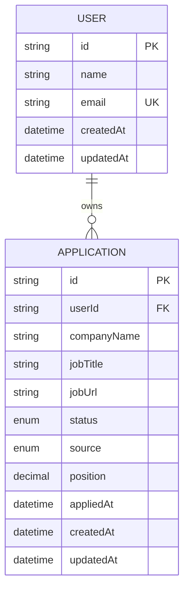

# Database Design

## 1. Overview

Job Application Tracker menggunakan PostgreSQL sebagai database relational dan Prisma sebagai ORM.

Untuk tahap awal, database hanya memiliki dua domain utama:

- `User`
- `Application`

Satu user dapat memiliki banyak application.

```text
User
 │
 ├── Application
 ├── Application
 └── Application
```

Database dirancang agar dapat dikembangkan dengan fitur tambahan seperti notes, interview schedule, reminder, dan analytics pada tahap berikutnya.

---

# 2. Entity Relationship Diagram



---

# 3. User

`User` merepresentasikan pengguna aplikasi.

Authentication akan menggunakan Auth.js. User merupakan owner dari seluruh application yang dibuat.

### Fields

| Field       | Type     | Description                |
| ----------- | -------- | -------------------------- |
| `id`        | String   | Unique identifier          |
| `name`      | String   | Nama user                  |
| `email`     | String   | Email user                 |
| `createdAt` | DateTime | Waktu user dibuat          |
| `updatedAt` | DateTime | Waktu terakhir user diubah |

Relationship:

```text
User 1 ──── N Application
```

Satu user dapat memiliki banyak application.

---

# 4. Application

`Application` merupakan entity utama dalam sistem.

Satu application merepresentasikan satu proses lamaran pekerjaan pada suatu perusahaan.

Contoh:

```text
Company:
Google

Position:
Frontend Engineer

Status:
TECHNICAL_TEST

Source:
LINKEDIN
```

### Fields

| Field         | Type              | Description                |
| ------------- | ----------------- | -------------------------- |
| `id`          | String            | Unique identifier          |
| `userId`      | String            | Pemilik application        |
| `companyName` | String            | Nama perusahaan            |
| `jobTitle`    | String            | Posisi yang dilamar        |
| `jobUrl`      | String?           | Link lowongan pekerjaan    |
| `status`      | ApplicationStatus | Tahapan proses recruitment |
| `source`      | ApplicationSource | Sumber lowongan            |
| `position`    | Decimal           | Posisi kartu pada Kanban   |
| `appliedAt`   | DateTime          | Waktu mengirim lamaran     |
| `createdAt`   | DateTime          | Waktu data dibuat          |
| `updatedAt`   | DateTime          | Waktu data terakhir diubah |

---

# 5. Application Status

Status menunjukkan posisi application dalam proses recruitment.

Status yang digunakan:

```text
APPLIED
    ↓
HR_INTERVIEW
    ↓
TECHNICAL_TEST
    ↓
USER_INTERVIEW
    ↓
OFFER
    ↓
HIRED
```

Selain flow utama, application dapat berakhir pada:

```text
REJECTED
WITHDRAWN
GHOSTED
```

## Status Definition

| Status           | Description                                                                        |
| ---------------- | ---------------------------------------------------------------------------------- |
| `APPLIED`        | CV sudah dikirim dan application sudah masuk                                       |
| `HR_INTERVIEW`   | Interview dengan HR / recruiter                                                    |
| `TECHNICAL_TEST` | Technical test, coding test, assignment, atau assessment                           |
| `USER_INTERVIEW` | Interview dengan user / hiring manager / calon team                                |
| `OFFER`          | Mendapatkan offering atau sedang dalam proses offering                             |
| `HIRED`          | Kandidat menerima offer dan proses recruitment berhasil                            |
| `REJECTED`       | Kandidat mendapatkan informasi bahwa tidak lolos                                   |
| `WITHDRAWN`      | Kandidat mengundurkan diri dari proses recruitment                                 |
| `GHOSTED`        | Tidak mendapatkan respons dari perusahaan/HR setelah melewati batas waktu tertentu |

### Ghosted vs Rejected

`GHOSTED` tidak sama dengan `REJECTED`.

```text
REJECTED
Company → memberikan keputusan → Tidak lolos

GHOSTED
Company → tidak memberikan respons → Tidak ada kepastian
```

Contoh:

```text
Application:
Frontend Engineer - Company A

Last response:
10 August

No response until:
25 August

Status:
GHOSTED
```

Status `GHOSTED` dapat ditetapkan secara manual pada MVP.

Pada pengembangan berikutnya, status ini dapat ditentukan otomatis oleh scheduler berdasarkan `lastContactAt` dan konfigurasi threshold.

---

# 6. Application Source

`source` menunjukkan dari mana user menemukan lowongan pekerjaan.

Contoh:

```text
LinkedIn
Facebook
Telegram
Friend
Company Website
Job Portal
```

Untuk menjaga konsistensi data, source menggunakan enum.

## ApplicationSource

```prisma
enum ApplicationSource {
  LINKEDIN
  FACEBOOK
  TELEGRAM
  FRIEND
  COMPANY_WEBSITE
  JOB_PORTAL
  REFERRAL
  CAMPUS
  OTHER
}
```

### Source Definition

| Source            | Description                                    |
| ----------------- | ---------------------------------------------- |
| `LINKEDIN`        | Lowongan ditemukan melalui LinkedIn            |
| `FACEBOOK`        | Lowongan ditemukan melalui Facebook            |
| `TELEGRAM`        | Lowongan ditemukan melalui Telegram            |
| `FRIEND`          | Informasi lowongan berasal dari teman          |
| `COMPANY_WEBSITE` | Lowongan ditemukan di website perusahaan       |
| `JOB_PORTAL`      | Lowongan ditemukan melalui job portal          |
| `REFERRAL`        | Mendapat referral dari seseorang di perusahaan |
| `CAMPUS`          | Lowongan berasal dari kampus / career center   |
| `OTHER`           | Sumber lain yang tidak masuk kategori          |

### Source vs Referral

`FRIEND` dan `REFERRAL` memiliki arti berbeda.

Contoh:

```text
FRIEND
Teman mengirimkan informasi lowongan melalui WhatsApp.
```

Sedangkan:

```text
REFERRAL
Teman yang bekerja di perusahaan tersebut secara resmi
mereferensikan kandidat ke perusahaan.
```

Jika aplikasi ingin lebih sederhana, `FRIEND` dapat dihapus dan semua referral personal menggunakan `REFERRAL`.

---

# 7. Kanban Position

Application akan ditampilkan sebagai card pada Kanban board.

Contoh:

```text
APPLIED

┌──────────────┐
│ Company A    │ position = 1
└──────────────┘

┌──────────────┐
│ Company B    │ position = 2
└──────────────┘

┌──────────────┐
│ Company C    │ position = 3
└──────────────┘
```

Field:

```text
position Decimal
```

digunakan untuk menentukan urutan card.

Fractional ranking digunakan agar proses drag-and-drop tidak membutuhkan update terhadap seluruh card.

Contoh:

```text
A = 1
B = 2
C = 3
```

C dipindahkan antara A dan B:

```text
A = 1
C = 1.5
B = 2
```

Dengan demikian hanya C yang perlu di-update.

---

# 8. Prisma Schema

Initial schema:

```prisma
enum ApplicationStatus {
  APPLIED
  HR_INTERVIEW
  TECHNICAL_TEST
  USER_INTERVIEW
  OFFER
  HIRED
  REJECTED
  WITHDRAWN
  GHOSTED
}

enum ApplicationSource {
  LINKEDIN
  FACEBOOK
  TELEGRAM
  FRIEND
  COMPANY_WEBSITE
  JOB_PORTAL
  REFERRAL
  CAMPUS
  OTHER
}

model User {
  id        String   @id @default(cuid())
  name      String?
  email     String   @unique

  applications Application[]

  createdAt DateTime @default(now())
  updatedAt DateTime @updatedAt
}

model Application {
  id          String            @id @default(cuid())
  userId      String

  companyName String
  jobTitle    String
  jobUrl      String?

  status      ApplicationStatus @default(APPLIED)
  source      ApplicationSource

  position    Decimal           @db.Decimal(30, 15)

  appliedAt   DateTime?

  createdAt   DateTime @default(now())
  updatedAt   DateTime @updatedAt

  user User @relation(
    fields: [userId],
    references: [id],
    onDelete: Cascade
  )

  @@index([userId, status])
  @@index([userId, source])
  @@index([userId, updatedAt])
}
```

---

# 9. Why Source Uses Enum

Source dibuat sebagai enum karena application membutuhkan data yang konsisten untuk analytics.

Contoh data yang buruk jika menggunakan String:

```text
LinkedIn
linkedin
LINKEDIN
Linkedin.com
linkdin
```

Dengan enum, semua data menjadi:

```text
LINKEDIN
```

Hal ini juga mempermudah analytics.

Contoh:

```text
Applications by Source

LinkedIn      15
Telegram       8
Friend         5
Job Portal     4
Facebook       2
```

Di masa depan, data tersebut dapat digunakan untuk mengetahui source mana yang paling efektif menghasilkan interview atau offer.

---

# 10. Why Source Is Stored on Application

Source merupakan attribute dari application, bukan dari user.

Satu user dapat menemukan application dari sumber yang berbeda.

Contoh:

```text
User: Fatah

Application 1
Google
Source: LINKEDIN

Application 2
Company B
Source: TELEGRAM

Application 3
Company C
Source: FRIEND
```

Karena itu `source` harus berada pada `Application`.

---

# 11. Application Status Transition

Status tidak boleh diubah secara bebas dari frontend.

Backend harus melakukan validation terhadap transition.

Contoh flow normal:

```text
APPLIED
   │
   ▼
HR_INTERVIEW
   │
   ▼
TECHNICAL_TEST
   │
   ▼
USER_INTERVIEW
   │
   ▼
OFFER
   │
   ▼
HIRED
```

Terminal state:

```text
REJECTED
WITHDRAWN
GHOSTED
```

Contoh transition yang valid:

```text
APPLIED → HR_INTERVIEW

HR_INTERVIEW → TECHNICAL_TEST

TECHNICAL_TEST → USER_INTERVIEW

USER_INTERVIEW → OFFER

OFFER → HIRED
```

Namun recruitment tidak selalu mengikuti flow yang sama.

Contoh perusahaan dapat melakukan:

```text
APPLIED
   ↓
TECHNICAL_TEST
   ↓
USER_INTERVIEW
```

Karena itu state machine harus mendukung beberapa transition yang valid, bukan memaksa satu urutan universal.

---

# 12. Indexing

Index utama:

```text
(userId, status)
```

Digunakan ketika mengambil application untuk Kanban.

Contoh:

```sql
WHERE userId = ?
AND status = 'TECHNICAL_TEST'
```

Index:

```text
(userId, source)
```

digunakan untuk analytics berdasarkan source.

Index:

```text
(userId, updatedAt)
```

digunakan untuk mengambil application berdasarkan aktivitas terbaru.

---

# 13. Time Handling

Semua timestamp disimpan dalam UTC.

Field yang menggunakan timestamp:

```text
appliedAt
createdAt
updatedAt
```

Contoh user berada di Jakarta:

```text
User input:
24 August 2026 10:00 WIB
```

Database menyimpan:

```text
2026-08-24T03:00:00Z
```

Frontend melakukan conversion dari UTC ke timezone user ketika menampilkan waktu.

---

# 14. Future Extensions

Database awal sengaja hanya memiliki:

```text
User
Application
```

Entity berikut dapat ditambahkan ketika fitur sudah dibutuhkan:

```text
Application
 ├── Note
 ├── Interview
 ├── Reminder
 ├── Activity
 └── Attachment
```

Contoh pengembangan berikutnya:

### Application Note

Menyimpan catatan:

```text
"HR bilang hasil technical test maksimal 1 minggu."
```

### Interview

Menyimpan:

```text
Interview type
Scheduled time
Meeting URL
Notes
```

### Reminder

Menyimpan:

```text
Follow up HR
Remind at: 2026-09-01
```

Entity tersebut **tidak dimasukkan ke initial database** untuk menjaga scope MVP.

---

# 15. Summary

Initial database architecture:

```text
                    ┌──────────────┐
                    │     User     │
                    ├──────────────┤
                    │ id           │
                    │ name         │
                    │ email        │
                    └──────┬───────┘
                           │
                           │ 1:N
                           ▼
                  ┌──────────────────┐
                  │   Application    │
                  ├──────────────────┤
                  │ id               │
                  │ userId           │
                  │ companyName      │
                  │ jobTitle         │
                  │ jobUrl           │
                  │ status           │
                  │ source           │
                  │ position         │
                  │ appliedAt        │
                  │ createdAt        │
                  │ updatedAt        │
                  └──────────────────┘
```

Dengan schema ini, MVP sudah dapat mendukung:

- Login user
- Menambah application
- Menampilkan application
- Kanban berdasarkan status
- Drag-and-drop application
- Mengubah status
- Menyimpan source lowongan
- Filtering berdasarkan source
- Analytics berdasarkan source
- Tracking application sampai hired/rejected/ghosted
